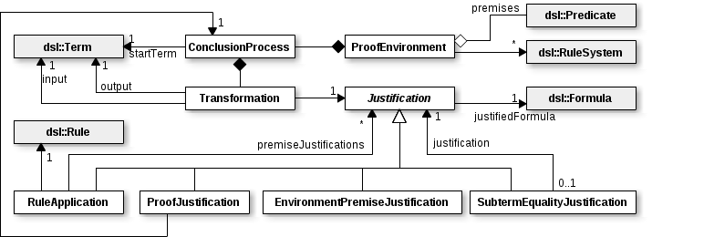

## 4 Core Concepts

This chapter describes the core concepts the application works with. They exist as classes in the `rapanui.core` package. The following class diagram outlines their relationship to each other:

### 4.1 Justification

The abstract class `Justification` represents the last step in a given formula's proof. Depending on the concrete subtype, it recursively references other justifications, creating a tree of justifications which form the entire proof.

There are 4 concrete subtypes of the `Justification` class, mirroring the 4 distinct approaches to suggestion (or rather, justification) generation presented in 5.2. They are:

* `EnvironmentPremiseJustification`, which implies that the justified formula is simply one of the premises given by the user.
* `ProofJustification`, which is used if the formula has already been proven by the user.
* `SubtermEqualityJustification`, which justifies the equality of two terms that only differ in one subterm. It references another justification that proves the equality of the differing subterms.
* `RuleApplication`, which applies one of the rules specified in the rule system. It contains a map to translate between the rule's abstract variables and the concrete terms which take their place. If the rule has premises, it also references a justification for each of them.

### 4.2 Transformation

A transformation represents the step from an input term to an equal or greater output term. It references a `Justification` that proves the correctness of that step. Transformations appear in two stages in the application: as suggestions, which may be applied to the currently last term of a transformation process, and, once they are applied, as part of the transformation process.

To apply a transformation to a transformation process (or conclusion process, see below), the conclusion process's last term must syntactically equal the transformation's input term. Once it is applied, the transformation's output term in turn becomes the conclusion process's last term.

### 4.3 ConclusionProcess

A conclusion or transformation process is, naturally, a series of terms and transformations between them. Starting with the initial term given by the user, and iteratively continuing the process by applying suggestions, the user proves equality or inclusion of terms.

### 4.4 ProofEnvironment

A `ProofEnvironment` serves as container for all the data related to a proof: the premises (a set of predicates) chosen by the user, the loaded rule system(s) and the conclusion processes the user is working on.

### 4.5 Application

To simplify common interactions, `rapanui.core` also contains a facade named `Application`.
